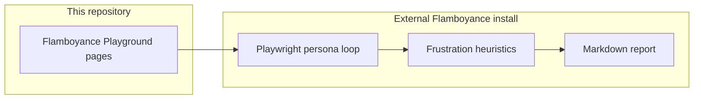

# Flamboyance fixture website — standalone build specification

## How to use this document

This file is **the complete product spec** for a small web application. The implementing agent should:

1. Treat every **must** statement as a requirement.
2. **May** choose implementation details not spelled out here (CSS framework, assets, copy tone) as long as behavioral and DOM requirements are met.
3. **Must not** depend on any other repository, private packages, or undisclosed context.
4. Ship a **working local server** documented in `README.md` so another machine can point automated browser agents at a stable base URL.

If something is ambiguous, prefer **simple, boring HTML semantics** and **path-based URLs** over clever SPA patterns.

---

## 1. Purpose

Build **Flamboyance Playground** (working name): a deliberately designed multi-page site used as a **target URL** for **Flamboyance**, an external tool that launches **Playwright-based synthetic users** (“personas”) against your app. Those agents click around like impatient or low-tech humans, record **frustration-style signals**, and produce reports.

**You are only building the website.** You are not implementing Flamboyance. The sections below describe how Flamboyance *consumes* your pages so you can shape HTML, routes, and friction patterns intentionally.

---

## 2. Flamboyance consumer contract (read this carefully)

All of the following describes **external software** that will hit your site. It is inlined here so this document stands alone.

### 2.1 What the agent clicks

The agent gathers **visible** elements matching this CSS selector (first **30** matches only):

`a, button, input[type='submit'], input[type='button'], [role='button'], [role='link'], [role='menuitem'], [role='tab']`

For each candidate it decides if the element is **interactive** (for frustration classification):

- **Interactive** if tag is one of: `a`, `button`, `input`, `select`, `textarea`
- **Or** if `role` is one of: `button`, `link`, `menuitem`, `tab`, `checkbox`, `radio`, `textbox`, `combobox`

It picks **one** random candidate per step and clicks it. It waits for `domcontentloaded` after navigation.

### 2.2 Persona-driven skips (affects who clicks what)

Built-in personas have numeric **patience** and **tech_literacy** in `[0, 1]`. Derived behavior relevant to your markup:

- If **`tech_literacy < 0.5`**: the agent **skips** elements whose `aria-expanded` attribute is exactly **`"false"`** (collapsed disclosure / menu trigger). It will not expand them first.
- If **`prefers_visible_text` is true** (one built-in persona): the agent **skips** elements with **no visible inner text** (e.g. icon-only buttons with no text node).
- **Early give-up**: if **`patience < 0.4`**, the agent may stop early after a fraction of the session timeout (persona-specific, e.g. 30–40% of timeout elapsed).

Other persona fields you should know about:

- **Viewport**: one persona uses **375×667**; others default to **1280×720**. Your layout should remain usable (nav discoverable) on both.
- **`max_actions`**: default 50 clicks per run for most personas; one persona allows **100**.

### 2.3 Frustration signals (what your pages can provoke)

The external agent records:

| Signal | Meaning for your design |
|--------|-------------------------|
| **circular_navigation** | Last three navigations were URL **A → B → A** with **A ≠ B** (full URL string equality as seen by the browser). Encourage real back-and-forth between two routes. |
| **rage_click** | **Three or more** “clicks” on the **same selector string** classified as **non-interactive** within **1.5 seconds**. Failed clicks and non-interactive elements count. |
| **unmet_goal** | Emitted when a run ends without a “goal reached” flag. **Current Flamboyance always ends with goal not reached**, so this appears on essentially every run until upstream adds goal detection. Design pages **without** relying on “zero unmet_goal” for success; use other signals + qualitative paths. |

### 2.4 Built-in persona reference (names and goals)

These names are stable identifiers in Flamboyance. Your `README` should mention them so operators can run e.g. `--persona non_tech_senior`.

| name | patience | tech_literacy | notes | goal (verbatim intent) |
|------|----------|---------------|-------|-------------------------|
| `frustrated_exec` | 0.2 | 0.8 | early exit ~30% of timeout | Complete a purchase flow quickly |
| `non_tech_senior` | 0.5 | 0.2 | skips `aria-expanded="false"` | Find and read account settings |
| `power_user` | 0.9 | 0.9 | — | Navigate all features and check edge cases |
| `casual_browser` | 0.5 | 0.5 | — | Browse around and see what's available |
| `anxious_newbie` | 0.3 | 0.3 | early exit; skips collapsed menus | Sign up for an account without getting confused |
| `methodical_tester` | 0.95 | 0.6 | up to **100** actions | Systematically check every link and form |
| `mobile_commuter` | 0.25 | 0.85 | viewport **375×667**; early exit ~30% | Quickly check order status while on the go |
| `accessibility_user` | 0.7 | 0.35 | **prefers_visible_text** | Navigate using visible labels and clear affordances |

---

## 3. Product goals and non-goals

**Goals**

- Provide **predictable** UX-friction patterns for demos and regression of Flamboyance.
- **No login**, no API keys, no third-party analytics that block or slow loads.
- **Offline-capable** after install: no required calls to external CDNs for core flows (local assets OK).
- Works in **headless Chromium** (Playwright).

**Non-goals**

- Real e-commerce, real auth, or production-grade security hardening.
- Pixel-perfect visual design.

---

## 4. Technical requirements

### 4.1 Stack

- **Must** use a stack you can document in two commands: e.g. `npm install` and `npm run dev`.
- **Recommended**: Vite + vanilla TypeScript, or plain static files served by `vite preview` / a tiny static server.
- **Avoid** hash-only routing (`#/page`) as the **only** navigation mechanism for scenarios that need **circular_navigation** by URL—use **distinct pathnames** (`/a`, `/b`) or a SPA that updates `history.pushState` so the browser URL changes.

### 4.2 Port and README contract

- **Must** document a **default dev URL** in `README.md` (e.g. `http://127.0.0.1:5173`).
- **Must** add a short note: consumers running agents **inside Docker** often use `http://host.docker.internal:<port>` (macOS/Windows) to reach the host—link to your chosen port.

### 4.3 Semantics and accessibility

- **Good paths** use real `<a href="...">` and `<button type="button">` (or `submit` on forms) with **visible text**.
- **Friction paths** may use misleading visuals, but **must** stay intentional (see scenarios)—no random broken semantics on the hub page.

---

## 5. Required site map

Implement a **hub** and **all** routes below. The hub **must** link to every scenario with human-readable labels.

| Path | Purpose |
|------|---------|
| `/` | Hub: explain the fixture in one short paragraph + links to all routes below. |
| `/shop` | Start of “purchase” flow. |
| `/cart` | Mid purchase flow. |
| `/checkout` | End state for “purchase” (show a clear success message—text is enough). |
| `/account` | Account area index. |
| `/account/settings` | Settings detail page (copy about “notifications”, “password”, etc.). |
| `/signup` | Simple signup form (fields + submit; fake submit OK—client-side “thank you” is enough). |
| `/order-status` | Order lookup UI (fake order number field or static “status” copy). |
| `/stress/circular` | Designed **A ↔ B** loop between two URLs (see §6.1). |
| `/stress/rage-decoy` | Decoy non-interactive “buttons” (see §6.2). |
| `/stress/hidden-menu` | Collapsed nav vs visible escape hatch (see §6.3). |
| `/stress/icon-bar` | Icon-only actions vs labeled actions (see §6.4). |
| `/stress/many-links` | **At least 35** distinct interactive targets on one view (see §6.5). |
| `/stress/slow` | Optional delay page (see §6.6). |

You may add extra routes if helpful; you **must not** remove or rename these paths without updating the spec.

---

## 6. Scenario specifications

### 6.1 Circular navigation (`/stress/circular`)

- **Must** implement **two** distinct URLs (e.g. `/stress/circular/a` and `/stress/circular/b`—subpaths of `/stress/circular` are fine).
- Each page **must** offer an obvious control to go to the other (links or buttons that navigate).
- **Must** include a **third** link on each page: “Exit to hub” → `/`.
- **Intent**: encourage Flamboyance to record **A → B → A** patterns.

### 6.2 Rage decoy (`/stress/rage-decoy`)

- **Must** include at least one **large, visible** element that **looks** clickable but is **not** a link/button (e.g. a `div` with button-like styling and `cursor: pointer` in CSS).
- **Must** also include a **real** `<button>` or `<a>` that proceeds to a harmless next state (e.g. “Continue to hub”) so the page is not a total dead end.
- **Intent**: failed or non-interactive clicks may cluster on the decoy selector.

### 6.3 Hidden menu (`/stress/hidden-menu`)

- **Must** include a nav disclosure **closed by default**: a control with **`aria-expanded="false"`** that wraps or labels the path to “Secret settings”.
- **Must** include an **always-visible** alternative route to the same content (e.g. footer link “Settings (easy path)”) so low-`tech_literacy` personas can still succeed without opening the disclosure.
- **Intent**: `non_tech_senior` and `anxious_newbie` skip the collapsed control; others may open it if they interact with it through other means (future agents may expand menus—your easy path still validates the fixture).

### 6.4 Icon bar (`/stress/icon-bar`)

- **Must** include a row where primary actions are **icon-only** (`aria-label` allowed, **no** visible text).
- **Must** include the **same actions duplicated** with **visible text** elsewhere on the page (“Save (text)”, “Delete (text)”).
- **Intent**: `accessibility_user` favors the labeled duplicates.

### 6.5 Many links (`/stress/many-links`)

- **Must** render **≥35** eligible targets under Flamboyance’s selector (§2.1) **at once**, all visible without scrolling if possible (or document in README if viewport forces scroll).
- Links **may** point to hash anchors on the same page or to trivial unique routes; they **must** be unique elements.
- **Intent**: stress the agent’s “first 30 only” sampling behavior.

### 6.6 Slow page (`/stress/slow`) — optional but recommended

- **May** delay first meaningful paint or show a loading banner for **~8–12 seconds** using client-side `setTimeout` before revealing main CTAs.
- **Must** document in README that this page is for **low-patience** personas and may cause timeouts.
- If you skip this route, replace it with a stub that explains “intentionally empty—add delay later” **and** keep the `/stress/slow` path reserved—**do not** remove the path from §5.

---

## 7. Acceptance criteria (implementing agent self-check)

Before considering the work done:

1. `npm run dev` (or equivalent) serves the hub at the documented URL.
2. Every path in §5 returns **200** and renders without uncaught console errors.
3. Hub lists every scenario with working links.
4. `/stress/circular` subgraph supports **A ↔ B** navigation plus escape to `/`.
5. `/stress/hidden-menu` has **`aria-expanded="false"`** on the collapsed control and a visible alternate path.
6. `/stress/many-links` has **≥35** interactive targets as defined in §2.1.
7. `README.md` includes: purpose, install, run, default URL, **Docker host hint**, persona names table (or link to §2.4 content duplicated briefly), and an example of how an operator **might** run Flamboyance (see §8).

---

## 8. Optional: validating with Flamboyance (operator-side)

This section is for humans; you do not implement Flamboyance in this repo.

Example smoke command an operator might run from their Flamboyance checkout (placeholders):

```bash
python -m agents.runner_local --url http://127.0.0.1:5173
```

They may also run a single persona against `/stress/hidden-menu`:

```bash
python -m agents.agent --url http://127.0.0.1:5173/stress/hidden-menu --persona non_tech_senior
```

---

## 9. Architecture context (informational)



---

## 10. Out of scope for this repository

- Changes to Flamboyance, MCP servers, or VS Code extensions.
- Hosted deployment (unless you add optional static export instructions—keep them secondary to local dev).
